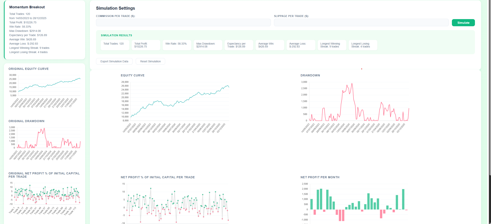
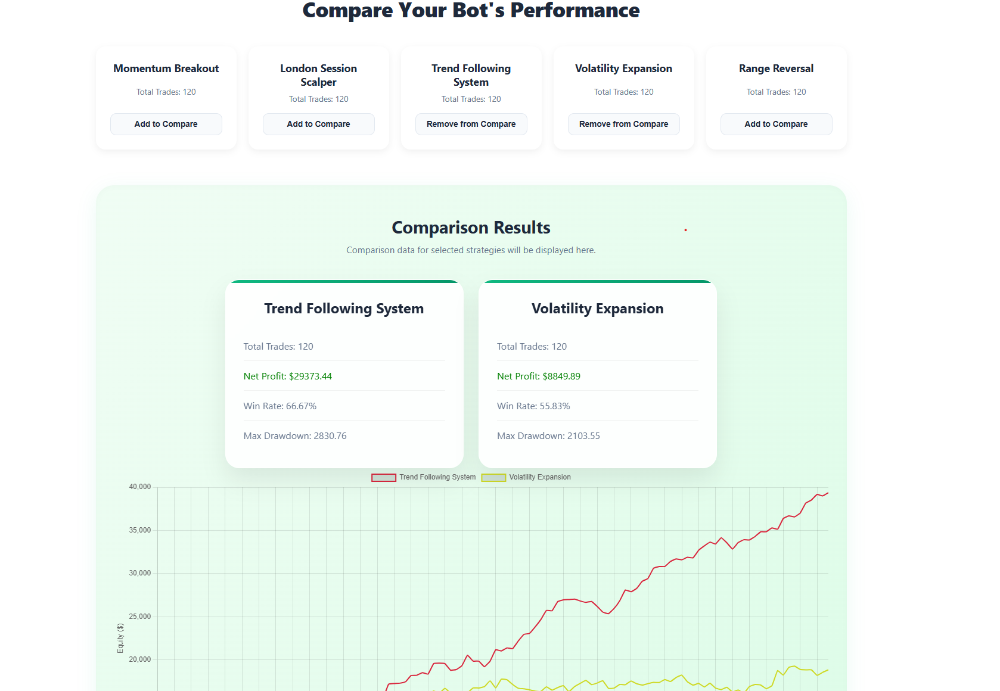
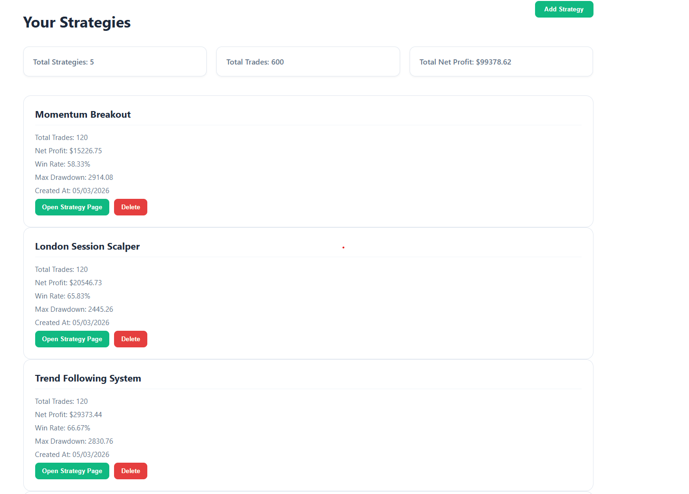

# TrackTrade

This is a full-stack project I built to help traders analyze and evaluate their algorithmic trading strategies. Instead of looking at raw spreadsheets, this platform turns trade history into visual charts and clear performance metrics.


## Live Demo
You can check out the live version here: [bot-intelligence-platform.vercel.app](https://bot-intelligence-platform.vercel.app/)

**Demo Login:**
* **Username:** `demo`
* **Password:** `demo123`

---

## What it does

### Performance Analytics
The system automatically processes your trade data and calculates the most important stats:
* **Equity & Drawdown:** Clear charts showing how your capital grows and where the biggest drops occur.
* **Core Metrics:** Win rate, profit expectancy, and net profit.
* **Streaks:** Tracking your longest winning and losing streaks to understand strategy consistency.



### Real-World Simulation
Trading "on paper" is different from trading in reality. The platform lets you add real-world variables like:
* **Commissions:** Account for broker fees per trade.
* **Slippage:** Factor in price execution gaps.
The metrics update instantly so you can see how these costs impact your bottom line.

### Strategy Comparison
You can compare different strategies side-by-side. This helps in deciding which strategy is actually more robust based on risk-to-reward, rather than just looking at the total profit.



---

## Tech Stack

I built this using a modern stack to keep the data processing fast and the UI responsive:

* **Frontend:** React, Chart.js, Axios, Day.js
* **Backend:** Node.js, Express
* **Database:** PostgreSQL
* **ORM:** Prisma
* **Deployment:** Vercel (Frontend) & Render (Backend)



---

## How to Upload Data
The platform accepts data via simple CSV files. The system parses the dates and profits automatically.

**CSV Format Example:**
```csv
date,netProfit
2023-01-01,120
2023-01-02,-80
2023-01-03,50
2023-01-04,140
